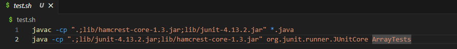
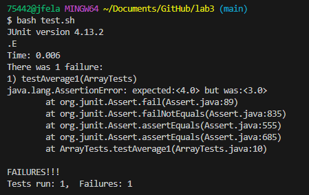
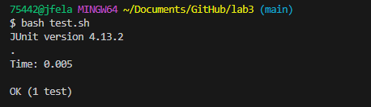

# Part 1
1.A failure-inducing input for the buggy program, as a JUnit test and any associated code
```ruby
import static org.junit.Assert.*;
import org.junit.*;

public class ArrayTests {

    @Test
    public void testAverage1() {
        double[] input1 = {3.0, 1.0, 4.0, 1.0, 5.0};
        // The lowest value is 1.0 (at index 1), and the average without the lowest is (3.0 + 4.0 + 5.0) / 3 = 4.0.
        assertEquals(4.0, ArrayExamples.averageWithoutLowest(input1), 0.001); 
    }
}
```
2.An input that doesn’t induce a failure, as a JUnit test and any associated code (write it as a code block in Markdown)
```ruby
import static org.junit.Assert.*;
import org.junit.*;

public class ArrayTests {

    @Test
    public void testAverage2() {
        double[] input2 = {2.0, 3.0, 4.0, 6.0, 8.0};
        // The lowest value is 2.0 (at index 0), and the average without the lowest is (3.0 + 4.0 + 6.0 + 8.0) / 4 = 5.25.
        assertEquals(5.25, ArrayExamples.averageWithoutLowest(input2), 0.001); 
    }
}
```
3.The symptom, as the output of running the tests<br>
__created test.sh to fast test file__ <br>
  <br>
__The symptom for testAverage1__ <br>
  <br>
__The symptom for testAverage2__ <br>
] <br>
